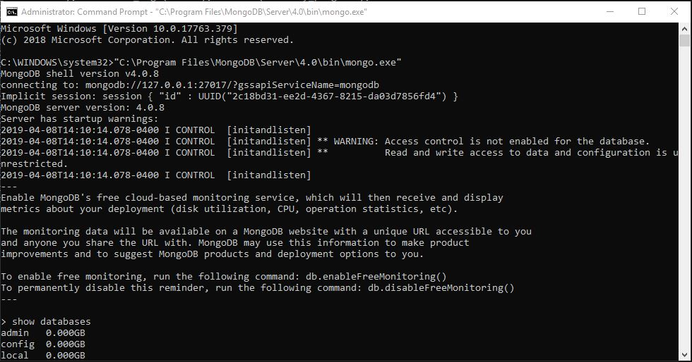
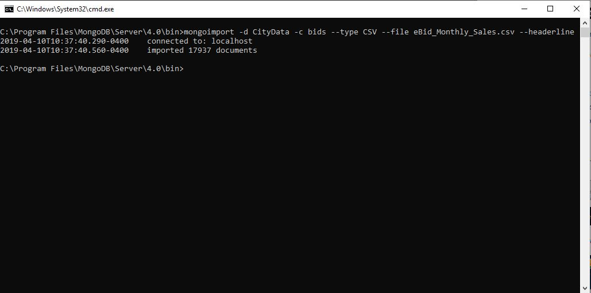

## MongoDB database creation process
[Return Home](index.md)

See the repository README.md for detailed instructions

### Installing MongoDB locally
[Click here](https://docs.mongodb.com/manual/tutorial/install-mongodb-on-windows/#install-mdb-edition) to install MongoDB

The instructions above provide a detailed step by step process to get the MongoDB database up and running. To complete this part of the task I interacted with it with the CLI. From here you can start the mongo shell and start to work directly with the database. Some of my initial work may be working with the shell directly, but much of the functionality will be completed with Python code.

### Importing database from eBid_Monthly_sales.csv
Using the mongoimport tool Imported the bids csv file into a database

