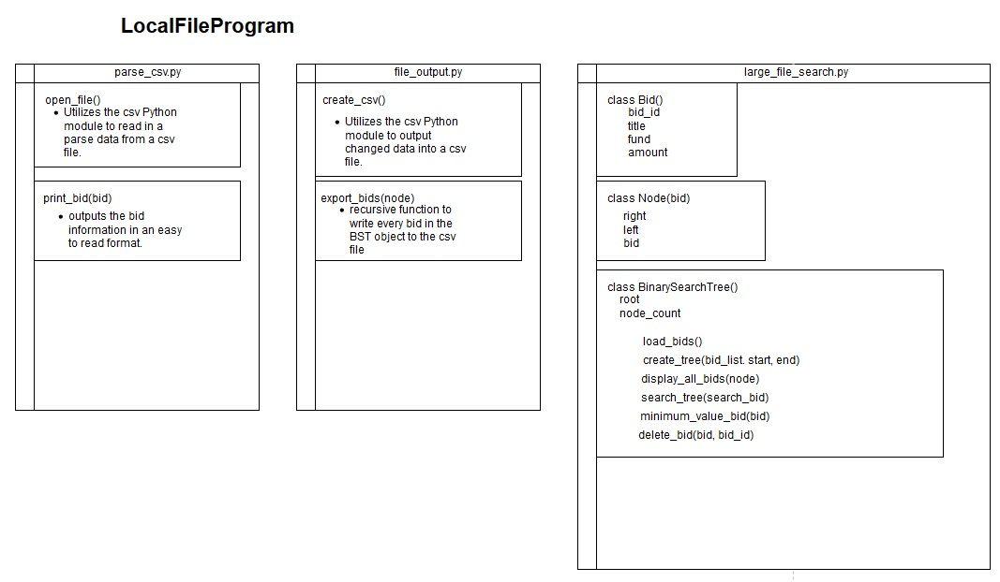
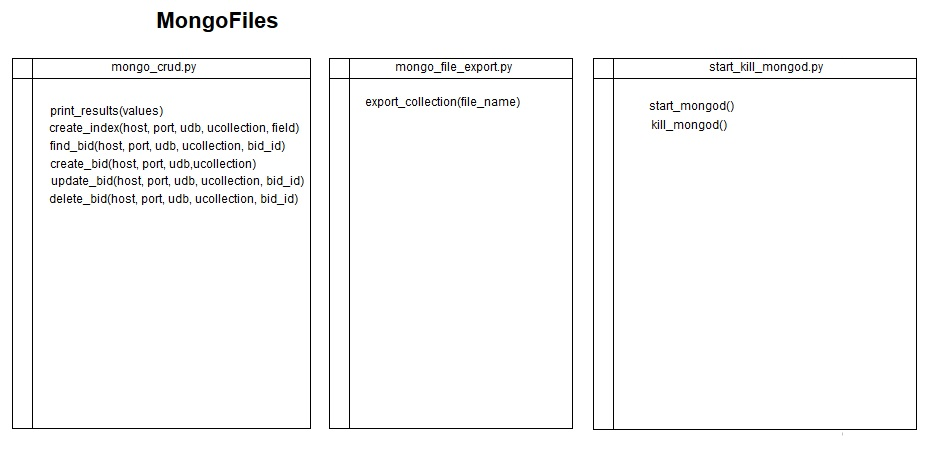
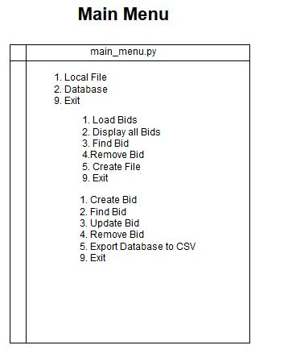

## Software Design/Engineering
[Return Home](index.md)

[Code Repository](https://github.com/JamesCourcelle/FinalProject)

--------------------------------------------------------------------------------------------------------------------------------

The file structure of the program splits the Local File program (Artifact one and two) and the MongoDB database. The Main Menu file that allows the user to choose between working with a local file or with the database.

--------------------------------------------------------------------------------------------------------------------------------

The LocalFileProgram directory handles all the code responsible for creating and manipulating the Binary Search Tree along with reading data in from a csv file and exporting it out after manipulation. 

--------------------------------------------------------------------------------------------------------------------------------

The MongoFiles directory holds all the files needed to interact with the MongoDB database. The CRUD and index operations are in the mongo_crud.py. The mongo_file_export.py handles the exporting of the MongoDB database to a csv file. The mongod_start_kill.py handles launching the MongoDB server and shutting it down when the appropriate commands are called in the main_menu.py

--------------------------------------------------------------------------------------------------------------------------------

The main_menu.py utilizes nested while loops that validate user input when navigating the menu and provide control to user to pick working with the local file program or the database.

